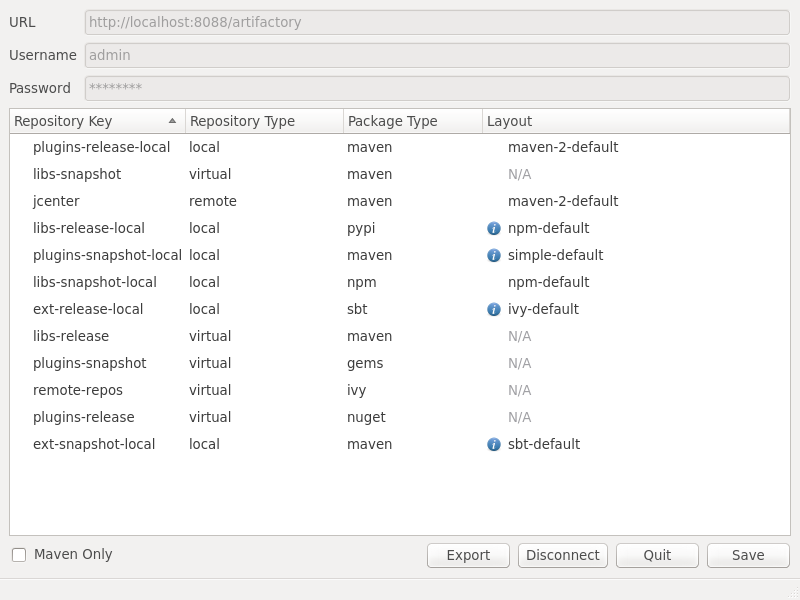

Artifactory 3 &rarr; 4 Migration Tools
======================================

Migrating an Artifactory instance from version 3 to 4 can cause some unexpected
problems, mostly due to the way the package type system was overhauled for
version 4. These scripts are designed to help ease the transition.

These scripts require [Python 2][] to run. Also, the `packageType.py` script
requires [Qt 4][] and [PyQt 4][]. It is recommended that you have the latest
versions of these packages installed.

packageCheck.py
---------------

Artifactory 4 supports exactly one package type per repository, but Artifactory
3 repositories can have multiple different package types at once. During the
migration to version 4, Artifactory will arbitrarily select one package type to
keep, which may not be the one you want.

The `packageCheck.py` script should be run before migrating from Artifactory 3.
It will examine your Artifactory instance and tell you which repositories are
configured to support multiple package types, and what types those are. From
there, you can remove any unneeded package types, and ensure that your
repositories will have the correct package support after migration. To do this,
it may be necessary to split a repository into parts. This can be done by adding
more repositories after migration, and moving artifacts to the new repositories.

To run this tool, use (for example):  
`./packageCheck.py http://localhost:8080/artifactory`

This tool supports a number of command line options:
- **--help:** Display a help and usage message.
- **--user:** Specify a username (and optionally a password) to log in with.
- **--output-file:** Specify a file to write the output to. If this is omitted
  or "-", stdout is used.
- **--xml:** Specify a local xml config file to check, in place of a running
  Artifactory instance. If the file is "-", stdin is used.
- **--verbose:** Print status of all repositories, rather than just the ones
  with multiple package types.
- **--json:** Output a JSON object, rather than plaintext.

packageType.py
--------------

In Artifactory 3, many package types are only implicitly defined, through the
layout or through other package-specific properties. Also, some package types
supported in Artifactory 4 do not exist in version 3. Because of these and other
related discrepancies, some repositories may not have the correct package
support after migration. For example, since the default layout in Artifactory 3
is Maven, some migrated repositories may be incorrectly classified as Maven
in Artifactory 4.

The `packageType.py` script should be run after migrating to Artifactory 4. It
will examine your Artifactory instance and display a list of all your
repositories, along with their package types and layouts. From there, you can
locate any offending repositories, and alter their package support and layout
properties accordingly, by clicking on their entries in the list. When you are
satisfied, you can save your changes back to your Artifactory instance. Note
that it is not recommended to modify Artifactory's system configuration during
the time `packageType.py` is connected to your instance, as this tool will
revert those changes when it saves its own.

To run this tool, use:  
`./packageType.py`

This tool will open a Qt window resembling the following:

- **URL:** The url of the running Artifactory instance to work on.
- **Username** and **Password:** An Artifactory user with administrator rights.
- **Export:** Export a list of repositories with non-default layouts to a file.
- **Connect/Disconnect:** Connect to or disconnect from the running instance.
- **Quit:** Exit the tool.
- **Save:** Save any pending changes to the connected Artifactory instance.
- **Maven Only:** Only display Maven repositories in the list.
- **Repository Key:** The repo's key. Hover over this to view its description.
- **Repository Type:** Whether this is a local, remote, or virtual repository.
- **Package Type:** The package type. This can be modified by clicking.
- **Layout:** The package layout. This can be modified by clicking. An icon is
  displayed if this layout is not the default for the selected repository type.
  A *N/A* is displayed for virtual repositories, which do not have layouts.

[Python 2]: https://www.python.org/downloads/
[Qt 4]:     http://download.qt.io/archive/qt/
[PyQt 4]:   https://www.riverbankcomputing.com/software/pyqt/download
